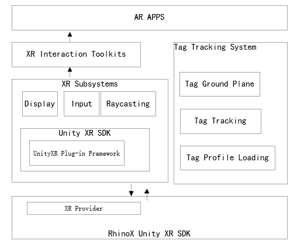

.. _1 总体介绍:

1.总体介绍Test
===============================

阅读指南
----------

此文档主要介绍如何使用RhinoX Unity XR SDK(以下简称SDK)开发AR应用，其中：

第1章，介绍SDK总体框架及相关概念

第2章，介绍SDK支持的硬件设备

第3章，提供SDK1的入门指南

第4章，介绍SDK的主要功能以及基本用法

第5章，提供详细的API使用说明

第6章，介绍开发工具的使用方法

第7章，介绍MR开发需要用到的扩展功能

第8章，提供一些常见问题解答

SDK架构
--------------------

RhinoX Unity XR SDK是专门为Unity开发者推出的新SDK包(以下简称SDK)，新增如下特性：

- 基于UnityXR Plug-in标准接口框架
- 支持新一代6-Dof环形手柄控制器

.. note::
    因为此SDK是基于Unity XR标准，如果您之前没有接触过Unity XR相关开发，请您务必先阅读 `Unity XR官方文档`_ 进行学习

.. _Unity XR官方文档: https://docs.unity3d.com/cn/current/Manual/XR.html

**Unity XR SDK**: Unity开发的一个新插件框架UnityXR Plug-in Framework，使用该框架的程序可以充分利用Unity引擎的功能

**RhinoX Unity XR SDK**: 燧光为Unity XR SDK的一个插件，通过UnityXR Plug-in Provider接口接入Unity XR SDK

**Tag Tracking System**：是基于燧光自研的X-Tag跟踪技术集成的一个定位信标识别系统，通过此系统可以实现物体跟踪以及空间锚定等功能。

**Tag Profile Loading**: 用于加载不同定位信标追踪文件的组件

**Tag Tracking**：用于实现物体跟踪的组件

**Tag Ground Plane**：用于实现空间锚定的组件

其他关于Unity XR的详细介绍请参考以下链接：

`Unity XR <https://docs.unity3d.com/Manual/XR.html>`_ ： Unity XR总体介绍 

`Unity XR interaction <https://docs.unity3d.com/Packages/com.unity.xr.interaction.toolkit@2.1/manual/index.html>`_ ：Unity XR交互组件

`XRDisplaySubsystem <https://docs.unity3d.com/Manual/xrsdk-display.html>`_ ：XR显示子系统

`XRInputSubsystem <https://docs.unity3d.com/Manual/xrsdk-input.html>`_ ：XR输入子系统

`XRSettings <https://docs.unity3d.com/ScriptReference/XR.XRSettings.html>`_ ：XR系统设置

`XRNodeState <https://docs.unity3d.com/ScriptReference/XR.XRNodeState.html>`_ ：XR跟踪节点

