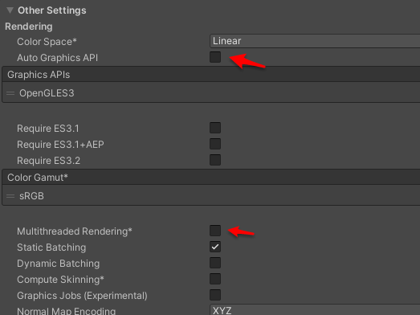

.. _5 RhinoX SDK 迁移到Unity XR SDK:

5.RhinoX SDK 迁移到Unity XR SDK
=======================================

如果你已有一个使用 RhinoX Unity SDK v1.x 系列的项目， 并且希望在不引入新的交互范式(如ActionBase, DeviceBase等交互库)的情况下，将此项目快速迁移到 RhinoX Unity XR SDK上, 可以按照此文档介绍的操作步骤. 

- 需要确保Unity项目的版本是 2019.4+ ，推荐2020.3.

- 需要提前下载RhinoX Unity SDK v1.6.0 版本, 只有此版本能对接 RhinoX Unity XR SDK. 

4.1 替换 v1.6.0 专用DLL
----------------------------------

将 RhinoX Unity SDK v1.6.0 中的 RhinoX-Unity.dll和 RhinoX-Unity-Editor.dll 这两个DLL文件覆盖项目
Plugins/RhinoX文件夹中的同名DLL文件.

完成操作后, SDK 的 Welcome window 会显示 version code 为 1.6.0

.. image:: _static/welcome_window_v1_6_0.png

4.2 导入 RhinoX Unity XR SDK
----------------------------------
.. note::
    
    在 Package Manager 中, 导入 RhinoX Unity XR SDK 开发包, 或者直接编辑 manifest.json 加入对应的引用路径。

4.3 删除或者禁用旧的安卓库文件
----------------------------------
在 Assets/Plugins/Android/lib中, 删除或者禁用旧 sdk 中的 xdevice-api.aar 和 其他的Androids 路径下的*.aar库文件.

     .. image:: _static/legacy_sdk_libraries.png

上图中这些库文件需要删除或者在unity中设置为不加载。

4.4 添加新旧SDK桥接组件, 并设置项目配置
---------------------------------------------------

**打开Unity场景，在 RxEventSystem 对象上， 添加 Legacy Input Provider**

**在 PlayerHand 对象上，添加 LegacyTrackReferenceProvider**

**在 ARCamera上, 添加 LegacyHeadPoseProvider 和 TrackedPoseDriver,并将各个字段设置为如下图所示的值**
    
.. image:: _static/legacy_sdk_ARCamera.png

**把 Quality 的 Vsync Count设置为 Don'tSync,  Anti Aliasing 设置为 Disabled**
    
.. image:: _static/legacy_sdk_QualitySettings.png

**在 PlayerSetting中, 把 multi-thread rendering 和 graphics job关闭**
    

